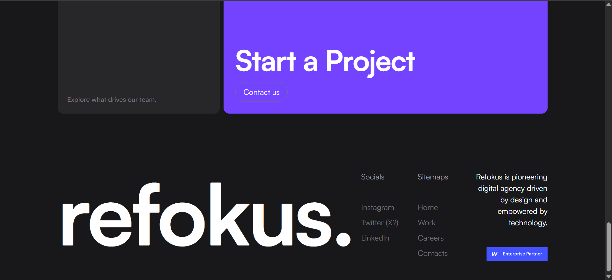

# 🌟 Refkous Clone - Modern Agency Website

This is a **Refkous Clone**, a creative agency landing page designed using **React JS**, **Tailwind CSS**, **Framer Motion**, and **Locomotive Scroll** for smooth scroll animations and interactive effects.

---

## ✅ Project Overview

Refkous is a creative agency website that showcases services, portfolio, team, and contact sections in a clean and elegant design.  
This clone is built purely for **learning purposes and personal use only**.

👉 **Key Features:**
- Smooth animations with **Framer Motion**  
- Scroll effects powered by **Locomotive Scroll**  
- Reusable **React component structure**  
- Tailwind CSS utility-first styling

---

## ⚡ Tech Stack Used

- ✅ React JS  
- ✅ Tailwind CSS  
- ✅ Framer Motion  
- ✅ Locomotive Scroll

---

## 🎯 Purpose of the Project

This project helps in practicing real-world frontend development skills by:
- Building reusable React components  
- Managing state and props  
- Implementing scroll animations and interactive effects  
- Applying Tailwind CSS utility styling

---

## 📷 Website Screenshot

<div align="center">




</div>

---

## ⚠️ Important Note

This project is a **clone created for learning purposes only**.  
All credits go to the original **Refkous Official Website**:  
[https://www.refkous.com](https://www.refkous.com)

_No copyright infringement intended._

---

## 🚀 How to Run Locally

1. Clone the repo  
   ```bash
   git clone https://github.com/vighnesh204/Refokus-UI-Clone.git


---


